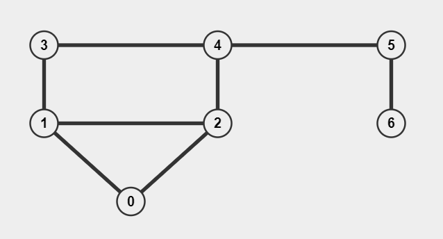

# Graph



[VisuAlgo](https://visualgo.net/en/graphds)

三種表示法：

```JavaScript
// 哪些 node(vertex) 之間有邊
// edgeList[0] = [0, 1]
// 代表 0 和 1 之間有 edge
const edgeList = [[0, 1], [0, 2], [1, 2], [1, 3], [2, 4], [3, 4], [4, 5], [5, 6]]

// 代表這個 node 對哪些 node 有 edge
// adjacencyList[0] = [1, 2]
// 代表 0->1、0->2
const adjacencyList = [[1, 2], [0, 2, 3], [0, 1, 4], [1, 4], [2, 3, 5], [4, 6], [5]]

// 當作矩陣來看
// adjacencyMatrix[0][1] 是 1
// 代表有 0 -> 1 的 edge
const adjacencyMatrix = [
  [0, 1, 1, 0, 0, 0, 0],
  [1, 0, 1, 1, 0, 0, 0],
  [1, 1, 0, 0, 1, 0, 0],
  [0, 1, 0, 0, 1, 0, 0],
  [0, 0, 1, 1, 0 ,1, 0],
  [0, 0, 0, 0, 1, 0, 1],
  [0, 0, 0, 0, 0, 1, 0]
]
```
