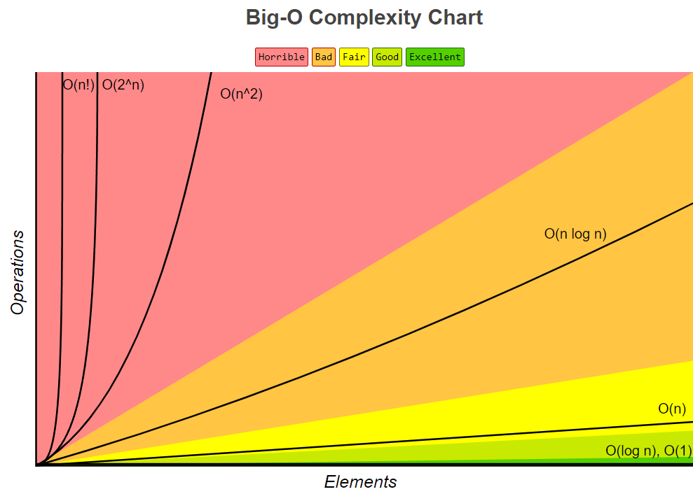
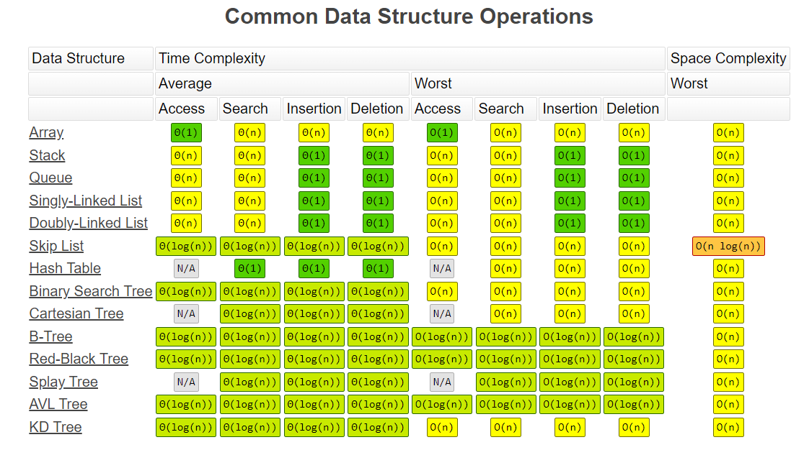
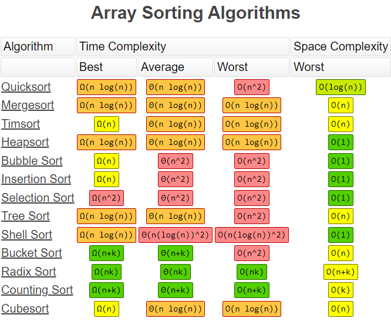

# Data-Structures-and-Algorithms

資料結構與演算法的練習、筆記。

## Complexity

不同電腦的硬體效能也不同，執行同一支程式所耗費的時間也就不盡相同。所以需要把變因排除，以標準化的指標比較程式的效能。

多用 Big-O 表示，此外也有 Big-Ω、Big-Θ 等漸進表示法。

[Big-O cheat sheet](https://www.bigocheatsheet.com/)

### 空間複雜度(Space Complexity)

程式執行時所需要的記憶體空間。

### 時間複雜度(Time Complexity)

執行程式所需的時間。

## Algorithm

### 各個擊破法(Divide-and-conquer strategy)

把原始問題拆成許多**獨立**的子問題，取得子問題的解答後，合併成原始問題的最終解答。例如遞迴。

### 動態規劃法(Dynamic Programming Strategy)

求最佳解。和各個擊破法類似，但子問題之間**非獨立**，互相分享解法。由下而上的方式(bottom-up)，解決子問題後把解答存入表格，爾後對於同類問題可透過查表避免重新求解，就像是 Divide & Conquer 加上 Memorization 的功能。上層結果必參考下層，所以輸出一定是整體最佳解(Global Optimal Solution)。

### 貪婪演算法(Greedy Strategy)

由上而下(top-down)，每個步驟都選擇區域最佳解(Local Optimal Solution)，也就是當前狀態下最好的選擇。但最終結果不一定是最佳解。

### 動態搜尋法(Tree searching strategies)

利用樹狀結構表達問題，以拜訪樹中節點的相關演算法來求解。
