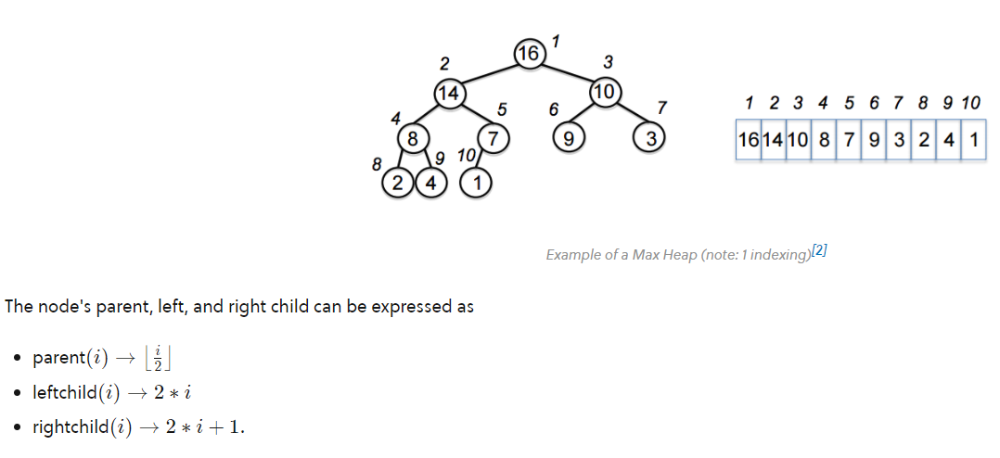

# Sorting

* [VisuAlgo](https://visualgo.net/en/sorting)
* [stable sort](https://stackoverflow.com/questions/1517793/what-is-stability-in-sorting-algorithms-and-why-is-it-important)：如果有相同大小的數據，會保留原本的順序。

## Bubble Sort

阿就冒泡。超廢。

* best: $O(n)$
* worst: $O(n^2)$
* stable sort

## Selection Sort

找到最小的 item，和未排序的第一筆資料交換。

* $O(n^2)$
* unstable sort => 例如 [4, 2, 3, 4, 1]
* 效率不佳

## Insertion Sort

把未排序資料插入到有序資料之中。

* best: $O(n)$
* worst: $O(n^2)$
* stable sort
* 資料幾乎快排好或資料很少時，用這個速度最快

## Merge Sort

將 array 拆到剩一個 item，再來兩兩合併排序。

* Divide & Conquer：可利用 recursion => 通常時間複雜度為 $O(n\log{}n)$
* stable sort
* best === worst === $O(n\log{}n)$
* space complexity: $O(n)$
* 如果怕遇到 worst case，可以用這個；但是用遞迴解很吃空間

## Quick Sort

* pivoting: 選一個數字當作 pivot，比它小的都放到它左邊，大的都放右邊
* Divide & Conquer：可利用 recursion => 通常時間複雜度為 $O(n\log{}n)$
* Worst：$O(n^2)$，如果選到最大或最小值當 pivot，那就沒辦法把 list 一分為二
* Space Complexity：$O(\log{}n)$
* unstable sort
* quick sort & merge sort 是最常用的排序演算法

## Heap Sort

[image source: Brilliant - Heap Data Structure](https://brilliant.org/wiki/heap-sort/)

* 把資料放入最大累堆中，子節點 ($i$) 比父節點 ($\lfloor\frac{i}{2}\rfloor$) 大的話就往上交換
* 步驟：
  1. 將最大值 (root) 和底層最右邊的 leaf 交換，將最後一個節點當作不存在 heap 內（已排序）。
  2. 若發現父節點小於子節點，則互相交換。
  3. 重複 3. 整理 binary tree 讓它是最大累堆。
  4. 回到 1. 直到節點數量為 0。

[iThome 鐵人賽：每日攝取一點資料結構和演算法](https://ithelp.ithome.com.tw/articles/10266206)

[Quicksort vs Heapsort](https://stackoverflow.com/questions/2467751/quicksort-vs-heapsort)：Heapsort 通常比較慢，但是任何情況下花費時間都差不多，不用擔心 worst case 的問題。平常可以使用 quicksort，偵測到 worst case 的時候改用 heapsort。

## Non-Comparison Sort

前面的都屬於 Comparison Sort。主要是靠著把數字互相比較來排序。

而 non-comparison sort 主要靠著電腦中儲存的資料來排序(?)。限制比較多，可能資料型別要是一定範圍內的整數才能排序。

[Radix Sort](https://brilliant.org/wiki/radix-sort/)、[Animation](https://www.cs.usfca.edu/~galles/visualization/RadixSort.html)

[Counting Sort](https://brilliant.org/wiki/counting-sort/)、
[Animation](https://www.cs.usfca.edu/~galles/visualization/CountingSort.html)
