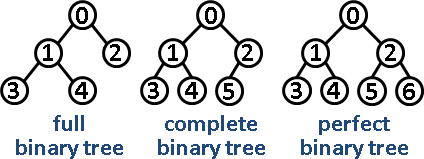

# Tree

full binary tree：除了 leaf 外每個節點都有兩個 child。

complete binary tree：除了最後一層外，各層節點全滿。最後一層節點全靠左。第 i 個節點的 parent 為 $\lceil \frac{i}{2} \rceil$ 。

perfect binary tree：各層節點全滿，同時為 full binary tree、complete binary tree。

* 最後一層的節點數量等於其他層總和 + 1。
* 第 L 層有 $2^L$ 個節點。
* 所以高度為 H 的 perfect binary tree 總節點數量為 $2*2^H-1$ 。

|manipulate|complexity|
|------|----------|
|lookup|$O(log N)$|
|insert|$O(log N)$|
|delete|$O(log N)$|

## Binary Search Tree

* 右邊 subtree 永遠大於自己，左邊的 subtree 永遠小於自己。
* 若不平衡的話，就等於在操作 linked list，時間複雜度會變成 $O(log N)$ 。所以需要 AVL tree、red black tree 等等自動平衡的樹。
